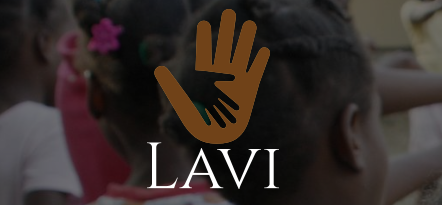
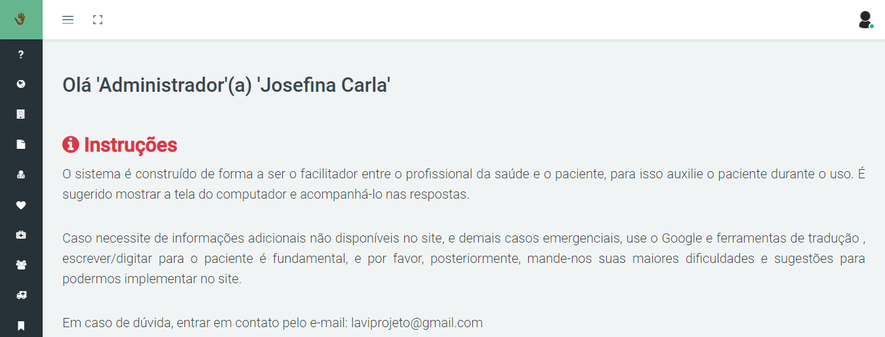

# Lavi System

# Objetivo

 Proporcionar uma interação entre os profissionais da
 saúde e pacientes estrangeiros (haitianos), não falantes da mesma língua, para realizar um atendimento médico em primeira instância ao paciente,  o qual irá suprimir as necessidades básicas de saúde e aumentar a qualidade de vida de um grupo socialmente frágil.

# Integrantes
- Ariadne Fabian
    - [LinkedIn](https://www.linkedin.com/in/ariadne-fabian-442949172/t)
    - [GitHub](https://github.com/AriadneF)
- Elian Nasatto
     - [LinkedIn](https://www.linkedin.com/in/elian-nasatto-b7698260/)
    - [GitHub](https://github.com/ElianNasatto)
- Heloisa da Silva Mengisztki
     - [LinkedIn](https://www.linkedin.com/in/heloisa-da-silva-mengisztki-17836517b/)
    - [GitHub](https://github.com/HeloisaMengisztki)
- Lucas Sembarki Higert
    - [LinkedIn](https://www.linkedin.com/in/Lucas-Higert)
    - [GitHub](http://github.com/lucasHigert)
- Mirian weber
     - [LinkedIn](https://www.linkedin.com/in/mirian-weber-69221b135/)
    - [GitHub](https://github.com/mirianmmweber)

# Itens 
* [Objetivo](#objetivo)
* [Imagens](#imagens)
* [Patrocinadores](#patrocinadores)
* [Estrutura](#Estrutura)

# Imagens 

## Sistema
 
##### 
- Instruções Gerais

    As instruções gerais, são uma forma de auxiliar o usuário
    (trabalhador da área da saúde) no comportamento, mediante a hora do atendimento ao paciente. Um breve resumo sobre a preoucupação que temos referente ao paciente.
  

 
-  [Tela de instruções gerais](View/Views/Instrucoes/Index.cshtml)
 

# Patrocinadores

- Entra 21.

- Ifsc Campus Gaspar.
# Diagrama do BD
 
# Estrutura 
[Model](Model) 

- Ele é responsável pela leitura e escrita de dados, e também de suas validações.

[View](View) 

- É camada de interação com o usuário, faz a exibição dos dados.

[Controller](Controller)

-    É responsável por receber todas as requisições do usuário. Seus métodos chamados actions são responsáveis por uma página, controlando qual model usar e qual view será mostrado ao usuário.

# Agradecimentos

Agradecemos ao [Instituto Federal de Santa Catarina - Campus Gaspar](https://www.ifsc.edu.br/campus-gaspar), pelo fornecimento e ajuda com os materiais de tradução, e aos diálogos com a comunidade externa de Haitianos em Gaspar, qual deu ênfase a relevância do projeto. Agradecemos ao Programa [Entra 21](http://www.blusoft.org.br/novo/programa/entra21), e todos que nele estão envolvidos, pela grande oportunidade de fazer parte do curso de formação em C#, aonde tivemos excelentes professores, que transmitiram grande conhecimento, assim  aplicando-o no projeto Lavi.
